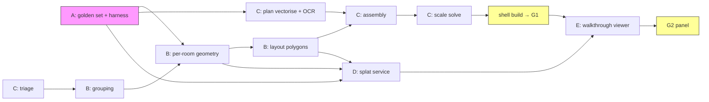

# Development roadmap — visit-it

Automatic 3D reconstruction of flat listings: unlabelled photos + (sometimes) a floor plan in → scaled architectural shell with photorealistic per-room Gaussian splats, waypoint-navigated in the browser.

**Basis:** `flat-3d-reconstruction-feasibility.html` (feasibility report, reviewed 19 Aug 2026, scope-amended 20 Aug) · [`docs/ARCHITECTURE.md`](docs/ARCHITECTURE.md) (decisions of record AD-1…AD-18) · [`docs/LICENSING.md`](docs/LICENSING.md) (what we can obtain and run) · [`docs/PHASE-0-REPORT.md`](docs/PHASE-0-REPORT.md) (**current status**).
> **Scope note (20 Aug 2026): internal, non-commercial.** This is built for our own
> use and will not be sold or published. Requirements that existed only to make it
> commercially shippable have been removed: data partnerships and agency
> integrations, copyright and licence gating, GDPR process, and tape-measure ground
> truth. Accuracy gates that depended on physical measurement are replaced with
> **self-consistency and plausibility checks** (§0b) so the project still has real
> pass/fail criteria rather than none.

**Planning assumptions:** 2-week sprints; core team of 4 (see §6 for the 2-person and 5-person variants); one rented L40S/A100-class GPU per engineer + one shared batch GPU. Phase 0 showed a free Colab T4 is enough to validate a stage end to end, so the GPU assumption is about iteration speed, not feasibility.

---

## 0. The one-page version

| Phase | Sprints | Weeks | Deliverable | Gate |
|---|---|---|---|---|
| **P0 Foundations** | S1–S2 | 1–4 | Golden set + eval harness + de-risk spikes + platform skeleton | **G0**: 30 listings, harness live, spikes green |
| **P1 Measurable shell** — *built, G1 not passed* | S3–S6 | 5–12 | Scaled, correctly-arranged 3D shell from plan+photos, in the viewer | **G1** 1 of 5 criteria passed; failures localised to the plan channel; kill criterion does not fire — [`docs/PHASE-1-REPORT.md`](docs/PHASE-1-REPORT.md) |
| **P2 Photorealism** | S7–S11 | 13–22 | Per-room splats inside the shell; full waypoint walkthrough on mobile | **G2** blind panel prefers it to the photo gallery |
| **P3 No-plan branch + hardening** | S12–S15 | 23–30 | Inferred-layout tier, review console, batch runner | **G3** ≥60% of listings need no manual fixing |
| **P4 Generative completion** | not scheduled | — | Filling in unseen surfaces | Optional; only once P1–P3 are solid |

Two useful things fall out along the way: the **P1 shell** is a working scaled floor plan on its own, and **P2** is the walkthrough. This ordering deliberately front-loads the stage most likely to kill the project (global assembly) and the discipline most likely to save it (the eval harness).

> **Amendment A (19 Aug 2026) — service profiles and speed targets.** A target was set: **5–10 s per analysis, marginal cost in single-digit pence**, so it stays cheap to run at volume. The full analysis — three service profiles (`instant`/`standard`/`premium`), price-point variants, unit economics on verified Aug-2026 GPU pricing, and three alternative dev journeys — is in [`docs/VARIANTS.md`](docs/VARIANTS.md); the architectural decisions are AD-16/17/18 in [`docs/ARCHITECTURE.md`](docs/ARCHITECTURE.md). **Journey C (twin-track) deltas are adopted into this plan**, marked ⚡ below: latency (M12) and COGS instrumentation from S1; feed-forward-splat and serverless cold-start spikes in S1; per-profile criteria added to G0–G3; the D-stream builds two stage-8 engines in P2 (+1 sprint, both-profiles GA ≈ week 32). The journey choice (A/B/C) is revisited once at G0 — until then C keeps all doors open at a cost of two spikes and some instrumentation.

## 0b. How we judge correctness without measuring flats

Dropping tape-measure ground truth removes the ability to say "this room is 3.6 m
wide and we got 3.7". It does **not** remove the ability to catch a broken
reconstruction. Three checks survive and cost nothing:

1. **Plausibility.** Ceiling heights must land in 2.3–3.2 m; rooms must not come out
   at 16 m across. This already caught the depth-model failure in Phase 0.
2. **Self-consistency.** Where a floor plan prints room dimensions (54% of ours, 62%
   of high-resolution plans), the reconstruction must agree with the plan's own
   numbers. No external measurement needed — the listing supplies both sides.
3. **Cross-model agreement.** Two independent models estimating the same quantity
   should agree. In Phase 0, MoGe and MapAnything independently put ceilings at
   2.71 m and 2.91 m, which is real evidence neither is badly wrong.

These are weaker than measurement, and the roadmap says so wherever a gate uses
them. They are strong enough to tell working from broken, which is what we need.

**Sequencing principle** (from the report, endorsed on review): build what is most valuable *and most verifiable* first, and every stage ships with a fallback and a confidence score.

---

## 1. Workstreams

Six streams, deliberately decoupled by the artifact contracts in `docs/ARCHITECTURE.md` §3 so they parallelise:

| Stream | Scope | Pipeline stages |
|---|---|---|
| **A — Data & Eval** | Golden set, metrics M1–M12, harness, annotation tooling, panel studies | (cross-cutting) |
| **B — Photo geometry** | Calibration, conditioning, grouping, per-room reconstruction, layout extraction | 1, 2, 3, 4 |
| **C — Plan channel & assembly** | Triage, plan detection/vectorisation/OCR, assignment, scale solve | 0, 5, 6, 7 |
| **D — Appearance** | Splat training service, culling, shell texturing, compression | 8 |
| **E — Viewer & delivery** | Three.js/Spark app, waypoints, streaming, honesty rendering, device perf | 9 |
| **F — Platform & ops** | Orchestrator, artifact store, review console, batch runner | (cross-cutting) |

**Decoupling contracts** (what lets streams run in parallel rather than in a chain):

- E never waits for the pipeline: from S1 it works against **hand-authored fixture artifacts** (`schemas/fixtures/`) — a fake `scene.json`, a hand-built shell, sample splats trained from a dense photo set. The contract, not the pipeline, is the interface.
- D never waits for grouping: it develops against **hand-grouped photos with COLMAP poses** from the golden set until stage 2/3 land, then swaps input source.
- B and C join only at stage 6 (assembly), which consumes both `rooms/*/layout.json` and `plan.json`; each side tests against synthetic counterparts of the other until then.
- A is upstream of everyone and therefore starts first and staffs heaviest in P0.

### Dependency graph (critical path in bold)

Critical path: **golden set → plan channel → assembly → scale → shell (G1) → splat quality inside the shell → viewer (G2)**. Grouping (B2) and splatting (D8) have slack — they must not be allowed to *become* the critical path, which is why both get fixture-based early starts.

---

## 2. Phase 0 — Foundations (S1–S2, weeks 1–4)

> Goal: make every later claim measurable, and kill the feasibility unknowns while the codebase is still small. **Build the scoring harness before the pipeline.**

### Sprint 1

| Stream | Work | Done means |
|---|---|---|
| A | Metric definitions doc (M1–M12 formulas, edge cases) — **including the Rent3D++ coverage-level protocol** (evaluate appearance at observed fractions 0.0/0.2/0.4/0.6/0.8/1.0, see [`docs/PRIOR-ART.md`](docs/PRIOR-ART.md) §6: the principled way to measure M8 against photo coverage, which is the report's central appearance risk); annotation spec (room polygons, adjacency, door positions, per-room areas); collect first 10 listings internally; optionally request Rent3D / Rent3D++ (215 annotated London flats would give stages 4–6 a regression set) | Spec reviewed; 10 listings ingested; harness skeleton running |
| B | **Spike:** MapAnything (`-apache` checkpoint) on 3 real listings' room groups (hand-grouped); GeoCalib on 20 listing photos; record runtime/VRAM/qualitative notes in `docs/spikes/`. ⚡ Measure MapAnything's **GPU seconds per forward pass** explicitly — no published figure exists and the instant profile's latency budget leans on it | Spike write-ups with numbers, go/no-go note per model |
| C | **Spike:** VLM triage prompt v0 over 10 listings (image type, room label, staging/mirror flags, structured JSON); plan-area OCR spike on 10 French plans (the `Séjour 24,5 m²` trick) | ≥90% plan detection on the sample; OCR area extraction works on ≥7/10 plans |
| D | **Spike:** gsplat on one photo-rich room (COLMAP poses) and one 4-photo room (MapAnything poses); floaters documented; SPZ export → file size. ⚡ **Feed-forward spike:** AnySplat and DepthSplat on the same rooms — seconds/room, VRAM, side-by-side quality vs gsplat | Splat spike write-up incl. feed-forward comparison; format pipeline proven end-to-end |
| E | **Spike:** Spark hello-world — one mesh shell + one splat cloud, correct occlusion, on desktop + one mid-range Android + one iPhone; define the **reference device matrix** | Hybrid render proven on all three; device matrix in `docs/` |
| F | Monorepo scaffold per ARCHITECTURE §8; `schemas/` v0 for all 10 artifacts; stage-runner CLI (`pipeline run <listing> --from <stage> --profile 
` ⚡ profile flag + per-stage wall-clock logging (M12) from day one); artifact store (MinIO) + Postgres; ⚡ serverless cold-start spike: our weight set on RunPod/Modal, cold-to-first-inference measured; artifact store + run ledger | `pipeline run` executes stub stages end-to-end on a fixture listing; latency log visible in the contact sheet |

### Sprint 2

| Stream | Work | Done means |
|---|---|---|
| A | Golden set to 30–50 listings: photos + plan + advertised area for all; frozen **holdout split** (≥20) sealed; harness computes M1–M8 against stubs; naive baseline recorded (monocular depth only, no plan) | Harness runs nightly; scoreboard page exists; baseline numbers published internally |
| F | ~~**Scraper build**~~ **DONE 20 Aug 2026** (`pipeline/ingest/`): Rightmove adapter working end-to-end (search + detail + media, wildcard-correct robots enforcement, rate limiting, non-dwelling filter). Zoopla adapter written but **blocked by Cloudflare from datacentre IPs** — needs a browser + residential IP; its field mapping is unverified. First set collected: 30 listings, 80% with plans, 553 images | Scraper fills the golden set ✅ |
| B | Turn spikes into stage skeletons: stage 1 (GeoCalib undistort + intrinsics artifact), stage 3 API (`reconstruct(images, priors)` plugin interface with MapAnything + MoGe-2 monocular backends) | Stages 1,3 produce schema-valid artifacts on 10 listings |
| C | Stage 0 triage v1 (VLM, structured outputs, phash dedup, listing-text parser for Carrez area/room count); measured against golden labels (M7) | M7 report: plan detection, image type, room label accuracies |
| D | Splat trainer as a service stub (queue in, SPZ out) on hand-posed rooms | 5 golden rooms splatted reproducibly by job id |
| E | Viewer skeleton app (TS, Three.js+Spark, loads fixture `scene.json`+shell+splats); waypoint teleport mechanics v0 | Deployed preview URL teammates can open on a phone |
| F | Review console stub: per-listing artifact browser ("contact sheet" of every stage output) — this is the debugging backbone for everything after | Any listing's stage outputs viewable in one page |

### Gate G0 (end of week 4)

- [ ] ≥30 listings collected with images and, where present, floor plans.
- [ ] Holdout split frozen before any tuning starts.
- [ ] Eval harness running nightly with a recorded baseline to beat.
- [ ] Spikes green: MapAnything runs at seconds-per-group; gsplat trains and exports;
      hybrid mesh+splat rendering works on the device matrix.
- [ ] Measured (not estimated) GPU seconds and cost per listing recorded.
- [ ] ⚡ Latency instrumentation live (M12 per stage); feed-forward and cold-start
      spike numbers recorded — these decide whether the 10 s envelope survives
      contact (VARIANTS.md §6 updated with our measurements).

**Kill criterion:** the reconstruction spikes fail outright — MapAnything cannot
place cameras on real listing photos, or the renderer cannot composite mesh and
splats on the device matrix. Everything else is recoverable.

---

## 3. Phase 1 — The measurable shell (S3–S6, weeks 5–12)

> Goal: listing in → **scaled, correctly-arranged, untextured 3D shell + interactive floor plan** out, in the browser. No splats. This is the report's "deliberately unglamorous and right" first product, and it exercises the killer stage (assembly) earliest.

> **Built (Phase 1 implementation note).** Sprints 3–6 below are the plan of
> record and are left unedited. What actually shipped differs in two places, both
> recorded rather than quietly substituted: the **plan vectoriser** is a classical
> raster engine rather than the RoomFormer-class network (no GPU or training set
> was needed to unblock stages 6–9, and it gives the learned model a measured
> baseline to beat — the `learned` engine binding is reserved for it), and
> **aperture detection** finds openings in the room's own point coverage rather
> than with SAM2 + Grounding DINO, for the same reason. Both are engine plugins
> behind the AD-4 interface, so swapping them changes no artifact contract.

### Sprint 3 — plan channel front half

| Stream | Work |
|---|---|
| C | Plan vectorisation v1: preprocessing (deskew, binarise) + wall/room extraction. Model plan: RoomFormer-class architecture, **pretrained on ResPlan (17K vector plans) + Swiss Dwellings (42K apartments) + CubiCasa5K (5K raster, which the other two lack)** — then **fine-tuned on our own annotated plans** for UK agency style. Annotation tooling for plans lands this sprint (A helps). Target: ≥80% room F1 on our plan validation split. |
| C | Plan OCR productionised: room labels + areas, total-area cross-check vs listing text; adjacency graph + door extraction v1. |
| B | Stage 4 v1 (monocular era): MoGe-2 point map → floor plane + wall RANSAC → room polygon under Atlanta-world regularisation; `approximate` flagging. Works on singleton rooms — multi-view comes in P2. |
| A | Annotation drive: plan polygons + adjacency for all golden listings; per-room GT areas table finalised. |
| E | Shell viewer: glTF shell loading, minimap component from `plan.json`, room click-through. |
| F | Orchestrator: DAG execution with per-stage retries, artifact versioning, run ledger; contact-sheet auto-generation per run. |

### Sprint 4 — plan channel back half + scale

| Stream | Work |
|---|---|
| C | Vectorisation v2 (door/window detection on plans; non-Manhattan support for haussmannien stock); confidence outputs. |
| C | **Scale solve v1** (stage 7): weighted least squares over Carrez area + OCR'd room areas + ceiling prior; residual report + QA flags. Door-height constraints join in P2 (needs photo detections). |
| B | Door/window aperture detection in photos v0 (SAM2 + Grounding DINO) — feeds assembly matching and, later, door-height scale constraints. |
| A | Harness: M1/M2/M4 computed on plan-channel outputs alone (plan → scaled polygons vs GT) — this isolates plan-channel error from photo-channel error, which G1 debugging will need. |
| E | Dollhouse view; measurement affordance behind a dev flag (display rule: only the advertised area is ever user-facing — ARCHITECTURE §5). |
| F | Review console: plan-vectorisation overlay editor (fix a wall, re-run downstream) — the first human-in-the-loop tool, and the fallback that keeps G1 achievable if vectorisation accuracy lags. |

### Sprint 5 — assembly

| Stream | Work |
|---|---|
| C | **Stage 6 v1:** Hungarian assignment of reconstructed rooms → plan polygons; cost = room-type match + area ratio + aspect ratio + window/door count; joint SE(2) refinement; `assembly.json` with per-match cost breakdown (instrument heavily — the report is right that this is the wrong-but-confident stage). |
| B | Room-polygon quality pass on golden set; failure taxonomy entries for the polygon failure modes (furniture occlusion, mirrors). |
| C+E | Shell builder (stage 8-lite/9): extrude assembled polygons, cut door/window apertures, flat-shade, glTF+Draco+KTX2 export ≤1 MB. |
| E | Viewer v0.9: walkthrough of the shell (waypoint per room centroid + doorway midpoints), minimap position sync. |
| A | First end-to-end eval: M1–M5 on the dev split, full pipeline. Publish the number, however bad. |
| F | Batch runner: whole golden set reprocessed nightly; regression alerts on metric drops >2σ. |

### Sprint 6 — iterate to the gate

All streams: burn the top of the failure taxonomy (expected leaders per the report: room-type confusions hall/bedroom and dining/living feeding wrong assignments; vectorisation misses on stylised plans; monocular polygon scale noise). A: run G1 eval on the **holdout** at sprint end. E: polish pass so the G1 demo is honest but presentable. F: assignment-nudge UI in review console (drag a room chip onto a different polygon, re-run 6→9 in seconds).

### Gate G1 (end of week 12)

> **Status: measured, and not passed.** Every stage 0–9 is built and runs end to
> end on CPU, and 22 of 30 golden listings reach a walkable shell — but on the
> frozen holdout only the shell-payload criterion clears its bar. Self-consistency
> lands at a median 14.3% against ≤10%; plausibility and cross-model agreement pass
> on a minority of listings; arrangement has too little annotation coverage to
> judge. The failures are localised: they are almost all the plan channel, and the
> **kill criterion does not fire** — self-consistency *is* inside ±10% wherever the
> vectoriser produced correct polygons. See
> [`docs/PHASE-1-REPORT.md`](docs/PHASE-1-REPORT.md) for the numbers, the two bugs
> the gate measurement found, and why training the plan vectoriser is now the
> highest-value task in the project.

Measured on holdout listings **that have a floor plan**. With no tape-measure
ground truth, correctness is judged by the three checks in §0b — weaker than
measurement, strong enough to separate working from broken.

- [ ] **Self-consistency:** where the plan prints room dimensions, reconstructed
      room areas agree within **±10%**. The listing supplies both sides, so this
      needs no external measurement.
- [ ] **Plausibility:** ≥80% of rooms have ceiling heights in 2.3–3.2 m and no room
      exceeds 12 m in any horizontal direction.
- [ ] **Arrangement:** rooms placed in the correct plan polygon on ≥70% of listings
      (checkable by eye against the plan).
- [ ] Shell loads < 2 s desktop / < 5 s mid-range mobile.
- [ ] Cross-model agreement: independent scale estimates within 15% of each other.

**Kill criterion:** if arrangement stays below 70% and self-consistency cannot be
brought inside ±10%, the assembly stage does not work and the rest does not matter.

---

## 4. Phase 2 — Photorealism and the walkthrough (S7–S11, weeks 13–22)

> Goal: per-room Gaussian splats anchored inside the G1 shell; the waypoint walkthrough that feels like a product. D and E now carry the critical path; B's grouping/multi-view work feeds them.
>
> ⚡ **Amendment A:** the D-stream builds **two stage-8 engines behind one interface** — feed-forward (AnySplat/DepthSplat-class, instant profile) in S7–S8, optimised gsplat (standard profile) in S9–S10 — and the viewer gains hot-swap upgrade-in-place (instant result first, standard splats replace them minutes later). This adds one sprint to P2 under Journey C (G2 lands end of week 24; G3 week 32). Sprint contents below are otherwise unchanged.

### Sprint 7 — conditioning + grouping

| Stream | Work |
|---|---|
| B | Stage 1 full: exposure/white-balance alignment within candidate room groups; composite/perspective-correction detector (GeoCalib-vs-pointmap-intrinsics disagreement gate from report §4.2) → `texture_only` demotion path. |
| B | Stage 2: DINOv2/MegaLoc retrieval → LightGlue+ALIKED (RoMa v1 for hard pairs) verification → graph clustering; VLM adjudication of low-confidence pairs; singleton routing. Eval M6 against golden hand-groups (target pairwise F1 ≥ 0.8 on textured rooms; measure, don't assume, on white-wall rooms). |
| D | Splat trainer v1: depth-regularised gsplat (reimplement DNGaussian-style regularisation natively — ledger forbids vendoring), init from stage 3; **polygon culling** against stage 4 layouts (the floaters fix, report §4.9). |
| A | Blind-panel protocol design (report G2 criterion): paired A/B "feel for the flat", n≥15 raters, rubric; dry run on 3 listings. |
| E | Room-at-a-time splat streaming (load current + prefetch adjacent); memory watchdog for iOS Safari ceilings. |
| F | GPU autoscaling for splat jobs; cost metering per listing (M10 dashboards). |

### Sprint 8 — multi-view geometry lands

| Stream | Work |
|---|---|
| B | Stage 3 full: MapAnything per group (3–8 images); confidence-masked point maps; COLMAP/GLOMAP alternate path when a room has ≥10 overlapping photos; cross-check MoGe-2 vs MapAnything on singletons. |
| B | Stage 4 v2: plane fitting on multi-view pointmaps replaces monocular polygons where available; aperture placement on wall planes; polygon accuracy re-measured (expect the report's benchmark-to-reality drop — measure it, publish it internally). |
| C | Assembly v2: door positions from photos join the matching cost; **door-height constraints join the scale solve** (2.04 m prior). |
| D | Per-room quality tiers: ≥6 views → full splat; 3–5 → splat with heavier regularisation; 1–2 → shell + projected texture only (report's view-count curve). Unobserved-surface fill: flat-shade + texture-extend (options 1–3 only; provenance-tagged). |
| E | Honesty rendering: provenance-driven treatment (photographed vs inferred), legend, Tier A/B badges. |
| A | M8 harness: held-out-view LPIPS/PSNR where a room has ≥4 photos (leave-one-out). |

### Sprint 9 — appearance pipeline complete

| Stream | Work |
|---|---|
| D | Shell texturing: MVS-Texturing projective pass where photos cover shell faces; seam/exposure blending; KTX2 compression; splat budgets enforced (200–500 K/room), SPZ + chunked-SOG (splat-transform) export. |
| B | Mirror detection v0 (SAM2-based segmentation + reflection heuristics) → mask from geometry, flag to viewer. |
| E | Waypoint graph generation from camera poses + doorway midpoints; transition animations; dollhouse ↔ walkthrough ↔ minimap sync complete. |
| C | Tier-B scaffolding begins ahead of P3: inferred-arrangement data model in `assembly.json` (`method: inferred`), so the viewer treatment can be built now. |
| A | Panel dry-run #2 on 10 listings; iterate rubric; recruit external raters (not team). |
| F | CDN packaging + cache headers; per-listing payload report in CI (fail >25 MB typical). |

### Sprint 10 — integration at scale

Process 50+ listings end-to-end. Streams swarm the integration failure list. E: perf pass on device matrix (30 fps target, first-room-interactive ≤5 s on 4G). D: floater/artefact triage on the worst 10 rooms. B: grouping errors that survived to render get adjudication-prompt fixes. F: review console gains splat-quality flagging + re-run-with-overrides.

### Sprint 11 — the panel and the gate

Freeze the pipeline; run the **blind panel** on ≥30 holdout listings (external raters; walkthrough vs photo gallery; "which gave you a better feel for this flat?" + would-show-to-a-buyer rubric). Fix nothing mid-measurement. Publish results internally, warts included.

### Gate G2 (end of week 22)

- [ ] Blind panel prefers the walkthrough on a **majority** of holdout listings (report kill criterion: if a splat with floaters is worse than the gallery, we've added cost and subtracted value).
- [ ] ≥70% of rooms with ≥3 usable photos reach "acceptable" on the panel rubric.
- [ ] Device matrix: 30 fps, first-room-interactive ≤5 s on 4G mobile, zero OOM tab-kills across the test suite.
- [ ] Measured cost ≤ €2/listing at current quality (M10), and G1 metrics have not regressed (shell accuracy is non-negotiable ballast).
- [ ] ⚡ Per-profile matrix published: **instant** — p95 ≤ 10 s, COGS ≤ £0.03, beats the "plan + photo lightbox" baseline in the panel; **standard** — ≤ 5 min, COGS ≤ £0.15, meets the beats-the-gallery bar above. Upgrade-in-place demonstrated on a live listing.
- **Pivot rule:** if the panel prefers the gallery, keep the Phase-1 shell (+ plan minimap + photo lightbox anchored to rooms) as the usable output while appearance quality is reworked. The shell is worth having on its own.

---

## 5. Phase 3 — No-plan branch, review economics, production (S12–S15, weeks 23–30)

> Goal: the degraded-gracefully Tier B product; the review console that makes unit economics work (the report's sharpest operational finding: human review costs rival all compute — reducing review rate is worth more than any GPU optimisation); production hardening.

### Sprint 12 — Tier B (no plan)

- B: doorway chaining — same-door detection across room groups (aperture signature + RoMa verification) → relative pose per shared doorway (expect ~⅓ of adjacencies, per report).
- C: layout inference — constraint-based arrangement synthesis (room count/types from triage, chained adjacencies, total advertised area, corridor conventions); output explicitly `method: inferred`.
- E: Tier B viewer treatment (visibly inferred arrangement, plain-language note); agent-facing 30-second drag-and-drop arrangement step (turns the unsolvable problem into a trivial one — report §7.1).
- A: Tier B metrics: room-level accuracy still measurable (per-room area, layout IoU per room); arrangement scored only as "plausible/implausible" by rubric.

### Sprint 13 — review console v1 (the margin machine)

- F/E: unified review flow: QA-flag queues → one-screen fix actions (reassign room, nudge arrangement, drop a photo from geometry, accept/reject) → targeted re-run. Target: median ≤3 min per reviewed listing (M11), instrumented.
- C: auto-QA routing thresholds tuned on residuals (scale disagreement, assignment cost margins, splat quality score) — the goal is *calibrated* flags: high recall on the listings a human would reject.
- A: reviewer time-and-motion measurement baked into the console.

### Sprint 14 — trust, privacy, robustness

- B: mirror/glass handling v1 (mask from geometry, flat reflective plane in render); virtual-staging detector v1 (multi-view object-consistency check + VLM flag) → staged objects excluded from geometry, since they break multi-view consistency.
- F: robustness pass — retry/backoff on ingest, disk hygiene, run ledger pruning.
- D: robustness sweep — HDR/flambient extremes, minimalist white rooms, haussmannien irregular polygons; document per-condition yield.

### Sprint 15 — production

- F: submission API (submit listing → webhook on ready/needs-review), batch mode, monitoring/alerting, SLOs; load test at 200 listings/day simulated.
- A: G3 eval at 200-listing scale on **freshly scraped listings**, not the golden set — the point is that they have never been seen.
- All: failure-taxonomy burn-down; docs/runbooks complete; security pass (`/security-review` on the services).

### Gate G3 (end of week 30) — production readiness

- [ ] Yield: ≥60% of plan-bearing listings come out usable with **no manual fixing** (M9); the rest take ≤3 min each to correct (M11).
- [ ] Tier B: no-plan listings produce labelled inferred layouts that pass the plausibility checks in §0b.
- [ ] Ops: 99% pipeline completion without manual intervention at batch scale; cost dashboard green.
- [ ] ⚡ Cost holds at batch scale: instant profile ≤ £0.03/listing with the latency SLO met; standard ≤ £0.15. Manual review never gates the instant profile — it degrades or refuses instead.

---

## 6. Parallelisation and staffing

### With 4 engineers (baseline plan above)

| | P0 | P1 | P2 | P3 |
|---|---|---|---|---|
| Eng 1 (ML geometry) | B spikes | B: stages 1,4 + apertures | B: stages 2,3,4v2 | B: doorway chain, mirrors, staging |
| Eng 2 (ML vision) | C spikes + A harness | C: plan channel, scale, assembly | C: assembly v2 + D support | C: layout inference + auto-QA |
| Eng 3 (3D/web) | E spikes | E: shell viewer + shell builder | E: walkthrough, streaming, honesty UX | E: Tier B UX + review UI |
| Eng 4 (platform) | F: scaffold, CI, store | F: orchestrator, review stub, batch | D: splat service + F: autoscale/CDN | F: console v1, batch runner, ops |
| Part-time owner | A: golden-set collection | A: annotations, eval reviews | A: panel studies | A: G3 eval |

Note the deliberate imbalance: stream A is owner-heavy early (collecting and annotating the golden set is judgement work that sets the standard everything else is measured against), and stream D is *shared* rather than owned until P2 — splatting has slack in the dependency graph.

### With 2 engineers (stretch: ~45 weeks)

Serialise D behind B (one ML engineer owns B→D), merge E+F (one product engineer). Phases become P0: 6 wks, P1: 12, P2: 14, P3: 12. Gates unchanged — never trade the gates for the calendar; cut scope inside sprints instead (e.g. defer dollhouse, defer Tier B drag-and-drop).

### With 5+ engineers

Fifth engineer takes D as a dedicated stream from S1 (fixture-driven), pulling splat quality work earlier and de-risking G2; P2 can compress to 4 sprints. Do **not** add people to stream C — assembly and scale are conceptually serial and gain little from splitting.

### Standing cross-cutting rules (every sprint's definition of done)

1. New/changed stage ⇒ schema versioned, confidence + QA flags emitted, contact-sheet renders it.
2. Eval harness updated in the same PR as the capability; nightly regression stays green; PRs post their eval delta.
3. New model or dataset ⇒ a row in `docs/LICENSING.md` recording where it comes from and any access conditions (application forms, dead links). Informational, not a gate.
4. Failure taxonomy updated when a new failure mode is seen twice.
5. Demo listing regenerated at sprint end (the same 3 listings throughout the project — progress must be visible on *stable* examples).
6. Inferred content stays visibly marked as inferred (ARCHITECTURE §10) — not for compliance, but because a viewer that hides which surfaces are real is one we cannot debug.
7. ⚡ Every stage lands its **fast binding first** (AD-17); per-stage latency budgets asserted in CI perf tests; a PR that pushes a stage over budget needs an explicit waiver in the PR description.

---

## 7. Risk register (top 8, owners assigned at kickoff)

| # | Risk | Likelihood | Impact | Mitigation / early warning |
|---|---|---|---|---|
| R2 | Assembly accuracy stalls below 70% | Med | Fatal to autonomy, not product | Isolated plan-channel metrics (S4) localise blame; human-assist assignment UI exists from S6; C3Po-style learned matching is the research lever |
| R3 | Benchmark-to-reality drop worse than expected on layout (report warns 20–40%) | High | High | Measured on golden set from S3; monocular fallback polygons + cuboid fallback keep yield non-zero; review-console wall editor |
| R4 | Splat quality below "beats the gallery" | Med | High (G2) | Quality tiers by view count; polygon culling; pivot rule at G2 keeps the company shipping |
| R5 | A model we depend on disappears — repo pulled, weights delisted, download rots (Rent3D already did) | Med | Med | Mirror the weights we actually use into `$VISITIT_DATA_HOME` and checksum them; engine plugin abstraction (AD-4) makes swaps cheap |
| R6 | Vectoriser training data is not UK agency-style | Low | Low | ResPlan, Swiss Dwellings, CubiCasa5K and Structured3D are all available; residual risk is only *stylistic*, handled by fine-tuning on our own annotated plans |
| R7 | Mobile memory ceilings kill the viewer on iOS | Med | High | Budgets CI-enforced from S9; room-at-a-time streaming from S7; device matrix testing every sprint from P2 |
| R8 | Too many listings need manual fixing | Med | Med | M11 instrumented from S13; auto-QA calibration is a first-class task, not a cleanup |
| R9 ⚡ | Instant engines underdeliver — AnySplat's per-scene time is unpublished, FastGS's speedup is claimed not verified | Med | Med | Both measured in the S1 spike; fallbacks identified: DepthSplat (0.6 s/12 views verified) for feed-forward, and gsplat at 10.4 s/room measured is already inside the standard-profile budget |
| R10 ⚡ | Feed-forward splat quality too low even for the instant tier's honest bar | Med | Med (V1 variant only) | S1 spike gives the answer 6 months early; fallback: instant profile ships shell + projected textures (still a real product), splats stay standard-only |

---

## 8. What we are explicitly *not* doing (v1 scope fence)

- No generative completion of unseen content for now (Phase 4 unscheduled). Not a legal position any more — simply that inventing content we cannot verify makes the output harder to trust and harder to debug.
- No free-roam navigation; no watertight meshing of splats (SuGaR etc.) — the shell is the mesh.
- Scraping is the acquisition route (Rightmove works; Zoopla is Cloudflare-blocked). Keep rate limiting and robots.txt compliance — they are good manners and they keep the scraper working.
- No panorama capture path (the whole point is photos-that-already-exist; panoramas would be a different product with a mature competitive field).
- No self-hosted VLM in v1 (API with an abstraction seam; revisit at volume).

---

## 9. Kickoff checklist (week 1)

- [ ] Repo scaffold merged (ARCHITECTURE §8 layout).
- [ ] Golden-set listing sources identified for the first 10; annotation tool chosen (start with CVAT/Label Studio, custom plan-overlay later).
- [ ] GPU environment reproducible (`infra/`, one command); MapAnything-apache + MoGe-2 + GeoCalib + gsplat weights pinned and hash-locked.
- [ ] Reference device matrix purchased/borrowed (mid-range Android, 2-gen-old iPhone, low-end laptop).
- [ ] Sprint 1 board cut from §2 of this document.
