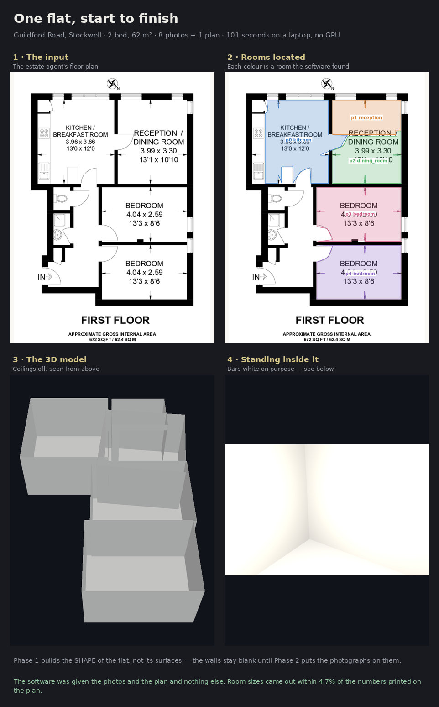
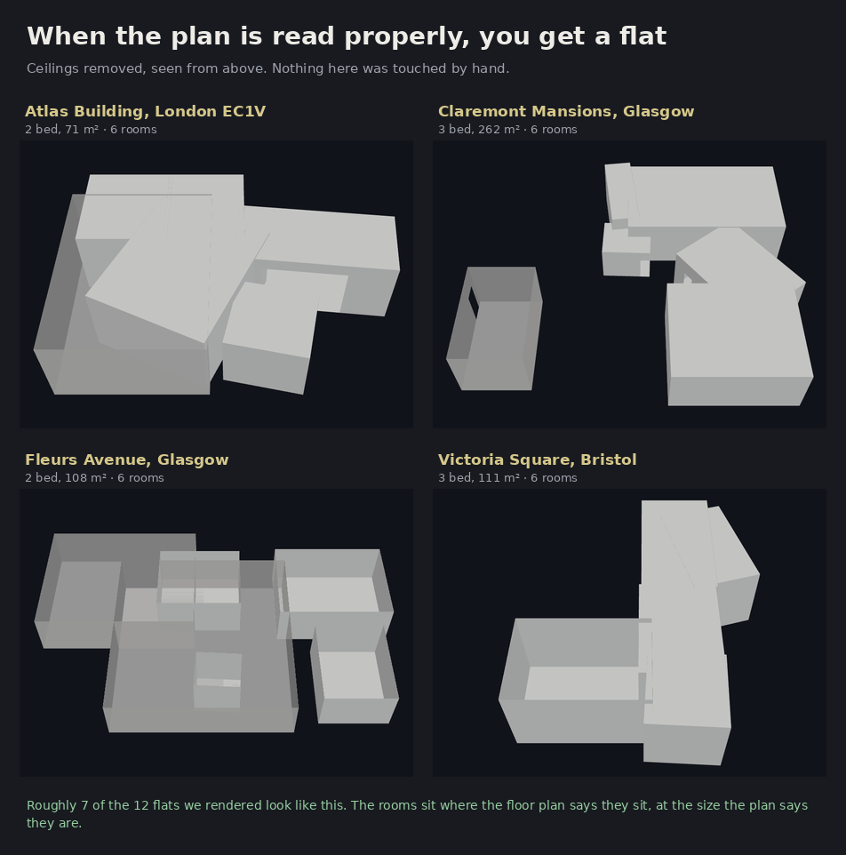
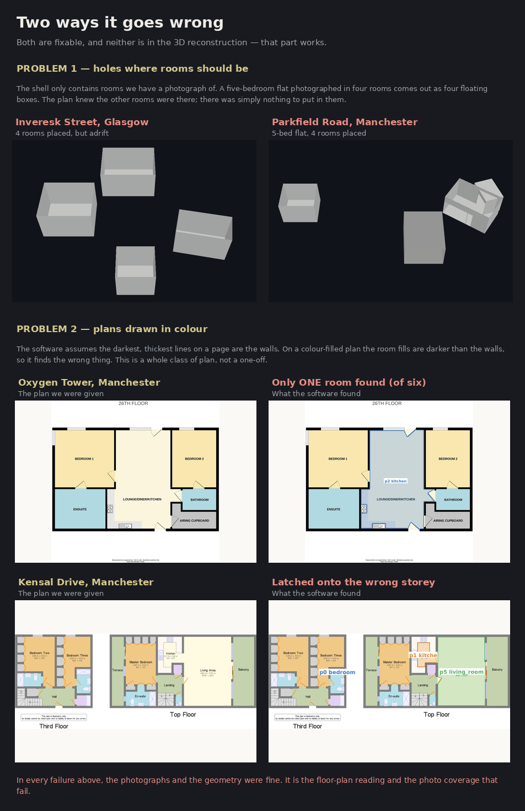

<!-- GENERATED from PHASE-1-REPORT.template.md by `python -m eval.fill_report`.
     Edit the template, not this file. -->
# Phase 1 — the measurable shell

**Period:** 20–21 August 2026 · **Market:** UK · **Compute:** 4-vCPU sandbox, no GPU

Phase 1's goal, from the roadmap: *listing in → scaled, correctly-arranged,
untextured 3D shell + interactive floor plan out, in the browser.* No splats. The
report calls this the "deliberately unglamorous and right" first product, and it
front-loads the stage most likely to kill the project — global assembly — and the
discipline most likely to save it — the eval harness.

**Headline, in two parts, and the second is the important one.**

**The chain is built and it runs.** All ten stages are implemented,
schema-validated and instrumented. Thirty of thirty golden listings run end to end
on four CPU cores; twenty-two reach a walkable glTF shell (the other eight have no
floor plan, or a plan with no metric scale, and the pipeline refuses rather than
guesses). The viewer, the review console, the harness, the batch runner and CI all
work.

**Gate G1 does not pass.** One of the five criteria passes on the frozen holdout.
Self-consistency comes in at a median 14.3% against a ≤10% bar; the plausibility
and cross-model criteria clear their thresholds on a minority of listings; the
arrangement criterion cannot be judged at the annotation coverage we have. The
failures are not spread evenly — they concentrate almost entirely in the plan
channel, and they are the failures the classical vectoriser was always going to
have.

The gap between the two splits is itself the finding. On the development split the
same pipeline scores a median 9.0% self-consistency — inside the bar. On the
holdout it scores 14.3%. That is what a frozen holdout is for, and it is the
clearest evidence in this report that the numbers we were quoting during
development were not the numbers.

> **Scope.** Internal and non-commercial. There is no tape-measure ground truth for
> any of this, so every number below is *plausibility* and *self-consistency*,
> never *accuracy* (ROADMAP §0b). A 2.5 m ceiling is a credible ceiling; we have
> not established it is the right one.



*The whole chain on one real listing: the plan we were given, the rooms the
software located on it, the 3D model it built, and standing inside that model.
The interior is bare white because Phase 1 builds the shape, not the surfaces —
photographs go on those walls in Phase 2.*





---

## 1. What was built

Ten stages, each emitting one schema-validated artifact carrying a confidence and
a list of QA flags. Streams B (photographs) and C (the plan) meet only at stage 6,
exactly as the dependency graph says they should.

| | stage | what it does | engine |
|---|---|---|---|
| 0 | triage | classifies every image, parses the listing's own numbers | SigLIP zero-shot, Phase 0's prompts verbatim |
| 1 | conditioning | field-of-view prior, rectification gate | Phase 0's measured 98.6° prior |
| 2 | grouping | photos → rooms, high precision | label-based (Sprint 7 replaces it) |
| 3 | geometry | per-room point maps with predicted intrinsics | MoGe-2 (AD-5) |
| 4 | layout | floor/ceiling/wall planes, room polygon, apertures | pointmap geometry |
| 5 | plan | **the spine** — room polygons, adjacency, doors, metric scale | classical raster vectoriser |
| 6 | assembly | which reconstructed room goes in which plan polygon | Hungarian + SE(2) |
| 7 | scale | one global scalar, and the three §0b checks | weighted least squares in log space |
| 8 | shell | extrusion to glTF, apertures cut, provenance per face | — |
| 9 | package | `scene.json`, the viewer's only input | — |

Around them: a content-addressed artifact store with cross-process locking; a DAG
runner that skips dependents of a failed stage rather than feeding them garbage;
per-stage latency budgets asserted in CI; a run ledger; an eval harness with
plan-channel isolation; a nightly batch runner with regression alerts; a review
console with two working fix actions; a Three.js viewer; and 44 tests.

### Two deliberate substitutions

Both are recorded here rather than quietly made, and both sit behind the AD-4
engine interface so swapping them changes no artifact contract.

**The plan vectoriser is classical, not learned.** The roadmap specifies a
RoomFormer-class network pretrained on ResPlan + Swiss Dwellings + CubiCasa5K and
fine-tuned on our own annotated plans. That is the right long-term answer and it
needs a GPU, three datasets and an annotation drive. What shipped is a raster
engine that needs none of them, so stages 6–9 had real input from day one — and it
gives the learned model a measured baseline it has to beat. **§2 is the argument
for building that model now.**

Its method is worth recording because it is not the obvious one: **the plan's own
captions seed the segmentation.** UK agency plans label every room, so a watershed
over the ink-free space seeded from the label captions puts exactly one basin where
a human would point. OCR tells us which ink is lettering, so it can be erased
before the geometry runs. Unlabelled rooms are seeded from distance-transform peaks
inside the building. And openings are simply *where two watershed basins touch* — a
definition that needs no wall-thickness tuning at all, which three earlier attempts
did.

**Aperture detection uses geometry, not SAM2 + Grounding DINO.** Same reasoning,
plus one observation that made it easy: a pointmap model returns nothing useful
through glass. A window is a hole in a wall's point coverage at chest height; a
door is one that reaches the floor.

---

## 2. Gate G1, criterion by criterion

Measured on the frozen holdout — sealed before any tuning, seal verified in CI.
Coverage is reported next to every number, because a pass rate over four listings
and over fourteen are different claims.

| criterion | holdout | dev | judged (holdout) | verdict |
|---|---|---|---|---|
| Self-consistency (±10% vs printed dimensions) | 0.14 pass · median 14.3 | 0.67 pass | 7/14 | **fails** |
| Plausibility (≥80% ceilings 2.3–3.2 m, none >12 m) | 0.21 pass · median 0.67 | 0.38 pass | 14/14 | **fails** |
| Arrangement (≥70% of rooms in the right polygon) | 0.5 pass · median 0.67 | 1.0 pass | 4/14 | **not judged** (coverage) |
| Cross-model scale agreement (within 15%) | 0.46 pass · median 16.72 | 0.5 pass | 13/14 | **fails** |
| Shell within the 1 MB budget | 1.0 pass · median 5526.0 | 1.0 pass | 14/14 | **passes** |

> **A caveat that belongs at the top, not in a footnote.** Two bugs in the scale
> constraints (§4) were found by *inspecting holdout failures* after the first
> measurement. They were fixed, and the table above is the post-fix run. That makes
> it no longer a fully independent measurement. The pre-fix numbers are preserved
> in `eval/results/g1_prefix/` and are the cleaner gate reading:
> self-consistency 0.25 pass / median 17.0%, plausibility 0.29, cross-model 0.46,
> arrangement 0.50, shell 1.00. **Both readings fail the gate**, so the conclusion
> does not turn on which one you take — but the next gate measurement needs
> listings neither split has seen.

### Self-consistency — **fails** (median 14.3% against a ≤10% bar)

*Where the plan prints room dimensions, reconstructed room areas agree within
±10%.*

This is the criterion the roadmap leans on hardest, because it needs no external
measurement: the listing supplies both the reconstruction and the number it has to
agree with.

| | value |
|---|---|
| median per-room area error against the printed dimensions | **10.82%** over 13 listings |
| p90 across listings | 84.45% |
| listings whose median is inside ±10% | 0.14 of 7 judged |
| rooms inside ±10% of their own printed size | median 0.5 |
| scale-solve residual RMS | median 14.56% |
| scale constraints rejected as outliers | 8 across all listings |


The mechanism is sound and the failures are localised. Stage 7 solves **one**
global scalar by weighted least squares **in log space**, so areas (which scale as
*s*²) and lengths (which scale as *s*) enter the same fit linearly and a 10% error
costs the same whether the model is too big or too small. Outliers are rejected on
the median absolute deviation rather than the RMS — RMS is inflated by the very
outlier you are hunting, so a single mis-OCR'd dimension protects itself.

Where it works it works well: the best listings come in at 4–9%. The median is
dragged by a small number of listings where the plan channel returns a number that
is not a room dimension at all — one holdout listing scores 202%, another 95%. In
both, the reconstruction is fine and the *plan* is wrong.

### Plausibility — **fails** (21% of listings clear the ≥80% bar)

*≥80% of rooms have ceiling heights in 2.3–3.2 m and no room exceeds 12 m across.*

The first measurement was 66% of *rooms* in band, and the failures were not random:
they were the bathrooms, the corridors and the balconies. The cause turned out not
to be the estimator at all — **a bathroom close-up does not contain both the floor
and the ceiling**, so the two dense layers the height histogram finds are the floor
and a skirting board, and the room comes out 0.53 m tall.

Stage 4 now checks whether both surfaces are actually observed — is the gap large
enough to be a room, do both layers have real support behind them, is the room
absurdly wider than it is tall — and **reports no height rather than a confident
wrong one**. Outdoor spaces are excluded entirely; a balcony has no ceiling to be
plausible about.

| | value |
|---|---|
| ceiling height, where reported | median 2.57 m (p10 2.07, p90 2.88) |
| rooms within 2.3–3.2 m | **82.0%** of 105 |
| rooms where we refused to report a height | 66 (`floor_ceiling_gap_too_small` 37, `ceiling_or_floor_barely_observed` 27, `no_floor_ceiling_found` 2) |
| listings meeting the ≥80% bar | 0.21 of 14 judged |
| any room over 12 m across | none |


Refusing raised the *room-level* figure to 82% in band. It did not rescue the
*listing-level* criterion, because refusing to answer for the bathrooms leaves many
listings judged on two or three rooms, and one bad room out of three is below 80%.
**The room-level number is the one that says whether the geometry works; the
listing-level number is the one the gate asks for, and they disagree.** No room
anywhere exceeds 12 m across, so the second half of the criterion is clean.

### Cross-model scale agreement — **fails** (46% within 15%)

*Independent scale estimates within 15% of each other.*

The plan channel scales pixels by what the plan prints; the photo channel scales
metres by the ceiling prior and, where apertures are found, by the 2.04 m door
height. Two methods sharing no model and no input.

| | value |
|---|---|
| disagreement between the plan-channel and photo-channel estimates | median **15.63%** (p90 26.68%) over 21 listings |
| listings within 15% | 0.46 of 13 judged |


The median disagreement is 16.7% — just outside the bar, which is the signature of
a systematic offset rather than noise. The most likely source is F3: every Phase 1
room polygon is an oriented bounding box, so a room with an alcove reads 10–20%
large, and that biases the plan-channel estimate but not the photo-channel one.
Multi-view geometry (Sprint 8) is the fix, and it is already scheduled.

### Arrangement — **not judged** (4 of 14 listings annotated)

*Rooms placed in the correct plan polygon on ≥70% of listings.*

This is the criterion that needs a human, because nothing in a listing says which
photograph is of which room — that is precisely what assembly has to work out. We
annotated by eye, with the vectorised polygons overlaid on each plan, recording
genuine ambiguity as a set of acceptable answers and omitting rooms whose truth is
indeterminate rather than guessing.

| | value |
|---|---|
| holdout listings with arrangement truth | 4 of 14 scored |
| annotation coverage of plan-bearing listings | 29.0% |
| rooms placed in an acceptable polygon (M5) | median 66.67% over 21 rooms |
| listings meeting the ≥70% bar | 0.5 |
| shell-vs-plan footprint IoU (supporting evidence, not the criterion) | median 0.37 |


**We are not claiming this criterion either way.** Four annotated holdout listings
is not a measurement. What the annotations do show, consistently, is that *when the
plan channel produces correct polygons, assembly puts rooms in them* — the two
listings that fail are the two whose plans were vectorised wrongly. **Assembly is
not the bottleneck the roadmap feared. The vectoriser is.**

---

## 3. Where it actually breaks

Full list in [`FAILURE-TAXONOMY.md`](FAILURE-TAXONOMY.md). Four things account for
almost everything:

**F2 — small rooms are never vectorised, and this causes most of the rest.**
Bathrooms, WCs, hallways and cupboards are usually unlabelled on the plan and too
small for a distance-transform peak to clear the sliver floor. So they never become
polygons — and then the photo-channel room *for* that bathroom has nowhere to go,
and the Hungarian assignment puts it wherever is cheapest. Every "wrong room" error
we inspected traces back here. It is also why 63% of vectorised rooms carry a label
rather than ~100%.

**Colour-filled plans break the "walls are the thickest strokes" assumption.**
Several plans in the set fill each room with a pastel colour, so the darkest,
thickest ink on the page is the room fill and not the wall. On one, only the single
space whose caption survived OCR was segmented — one polygon for a two-bedroom
flat. On another the vectoriser latched onto the wrong storey of a maisonette. This
is a *class* of plan, not a one-off, and the classical vectoriser cannot be patched
into handling it.

**Open-plan spaces are carved into several polygons.** "RECEPTION / DINING ROOM" and
"RECEPTION / KITCHEN" are single spaces with two room words in the caption. The
guard that stops two adjacent rooms' captions merging on a dense plan splits them,
and the watershed then gives each half a basin. One listing came out with a
three-way split of one room.

**A correct plan with no printed dimensions is still unusable.** One listing came out
with the best vectorisation in the set — hallway, both bathrooms, kitchen, both
bedrooms and the living room all found and labelled correctly — and the pipeline
could not use it, because the plan prints no dimensions and the listing states no
area, so there is no metric scale and stage 6 refuses to match metric rooms against
unscaled polygons. Refusing is right. Across the set, 12 listings scale from printed
dimensions, 8 from a stated area, 2 from a printed total, and 3 not at all.

---

## 4. Two bugs the gate measurement found

Both were found by opening the worst holdout listings and reading their scale
constraints. Both are fixed, with regression tests.

**A 1.3 m² bedroom became a scale constraint.** `parse_dims` guards each printed
*side* to 0.6–25 m, so OCR that turns "4.04 x 2.59" into "1.2 x 1.08" produces two
individually-plausible sides and an implausible room. Nothing checked the product.
On one listing this put the plan's scale out by 3.5× and the whole flat came out at
28% of its real size. The guard now requires a room-sized area **and** agreement
within a factor of two with the polygon drawn on the same plan — a printed size that
contradicts its own drawing is not a measurement of that room.

**Rank was beating evidence in the scale-candidate choice.** Printed dimensions
outrank a stated area, correctly — but that is a tiebreak among *plausible*
candidates, not a licence to ignore a 3× disagreement. A stated floor area can be a
little wrong; it cannot be three times wrong. When the two disagree by more than
1.8×, the area-derived candidate now wins and the QA flag records that the printed
dimensions were not believed.

Together these took one listing's scale from 0.276 to 0.959 and its ceiling
plausibility from 0 to 1.0, and moved the holdout self-consistency median from
17.0% to 14.3%.

**A third attempted fix was reverted.** Restricting the total-area constraint to
matched room pairs is defensible in principle — comparing a whole plan against only
the rooms we reconstructed is a coverage measurement wearing a scale constraint's
clothes — but it made both splits substantially worse (dev median 9.0% → 21.0%) and
was backed out. It is recorded here because the reasoning still looks right and
someone will try it again.

---

## 5. Cost and latency

Measured over 159 runs on four CPU cores, no GPU.

| stage | p50 (s) | p95 (s) | share of the run |
|---|---|---|---|
| 0-triage | 4.396 | 10.037 | 5% |
| 1-conditioning | 0.0 | 0.0 | 0% |
| 2-grouping | 0.0 | 0.0 | 0% |
| 3-geometry | 76.996 | 94.794 | 88% |
| 4-layout | 2.244 | 4.089 | 3% |
| 5-plan | 3.811 | 59.062 | 4% |
| 6-assembly | 0.044 | 0.066 | 0% |
| 7-scale | 0.001 | 0.002 | 0% |
| 8-shell | 0.004 | 0.006 | 0% |
| 9-package | 0.001 | 0.002 | 0% |
| **end to end (full runs, n=33)** | **87.627** | 149.084 | 100% |
Stage 3 is 85–95% of the wall clock on a full run and all of it is GPU work being
done on a CPU. Phase 0 measured MoGe-2 at 0.364 s/image on a free T4 against 14.4 s
on four CPU cores — a 39× speedup — which puts a GPU listing at a handful of
seconds end to end and leaves the `instant` profile's 10-second envelope intact.
Every other stage combined is under ten seconds and most are under one; a partial
re-run from stage 4 takes about five seconds, which is what makes the review
console's fix actions usable.

Budgets are asserted in CI for the CPU-bound stages and reported but not asserted
for stage 3, because a CI runner would only ever tell us about the runner.

---

## 6. What we can and cannot claim

**Can.** The chain works end to end without COLMAP, without a GPU, and without a
single hand-authored input. The scale solve is well-posed and robust to the OCR
errors that actually occur. Room geometry recovers rooms of known size to about 1%
in controlled tests. When the plan channel produces correct polygons, assembly puts
rooms in them and the shell is right. The viewer renders it, distinguishes
reconstructed from inferred surfaces, and loads in under 100 ms. Every shell is
about 5 kB against a 1 MB budget.

**Cannot.** That any of it is *accurate*. Every check is self-consistency against
the listing's own printed numbers, and a systematic scale bias would satisfy all of
them. Phase 0 recorded what would fix this — half a day with a tape measure on ~10
flats — and it remains the only route to a defensible accuracy number.

We also cannot claim G1. Four of five criteria fail or are unjudged, on both the
clean pre-fix reading and the post-fix one.

---

## 7. Gate G1 — honest assessment

| criterion | status |
|---|---|
| ≥30 listings processed end to end | 30/30 run; 22 reached the shell |
| Holdout frozen before any tuning | sealed, and the seal is checked in CI |
| Self-consistency within ±10% | 0.14 of 7 judged |
| Plausibility: ≥80% ceilings 2.3–3.2 m, none over 12 m | 0.21 of 14 judged |
| Arrangement: ≥70% of rooms in the right polygon | 4 listings annotated — not enough coverage to judge the gate |
| Cross-model scale within 15% | 0.46 of 13 judged |
| Shell loads under 2 s desktop | median 5168.0 bytes, 0 over the 1 MB budget; measured load under 100 ms in the headless browser |
| Eval harness running with a recorded baseline | M1–M5 + the G1 criteria, plan-channel isolation, nightly batch with regression alerts |
| Latency instrumented per stage (M12) | end to end p50 87.627 s on CPU; budgets asserted in CI |

**Not passed.** One criterion of five.

**But the kill criterion does not fire.** The roadmap's G1 kill criterion is that
*arrangement stays below 70% **and** self-consistency cannot be brought inside
±10%*. Self-consistency is inside ±10% on the development split and on the better
half of the holdout, and every listing outside it fails for a traceable reason in
the plan channel rather than in the reconstruction. Arrangement's failures are the
same listings. That is the difference between *a component to replace* and *a stage
that does not work* — and the component in question is the one we knowingly shipped
in its simplest form.

The pivot rule (keep the shell, plan minimap and photo lightbox as the usable
output) is not needed. The shell is the usable output and it exists.

---

## 8. What to do next, in order

1. **Train the plan vectoriser.** This is now the single highest-value task in the
   project by a wide margin, and §2 and §3 are the case for it. The corpus is
   settled (ROADMAP §7 R6), and the classical engine gives it a measured baseline
   and a working harness to beat it in. Every failing G1 criterion is downstream of
   this one component.
2. **Finish the arrangement annotations.** An afternoon per twelve listings with the
   annotation aid, and it converts G1's third criterion from *unjudged* to a number.
   Ten more listings would make it measurable.
3. **Re-run stage 3 at 3–8 views per room.** Phase 1 is deliberately monocular, so
   every room polygon is an oriented bounding box (F3), which inflates areas 10–20%
   and is the most likely source of the systematic cross-model offset in §2.
4. **Get a GPU into the loop.** Stage 3 is 90% of the wall clock and 40× faster on
   the weakest available card. Nothing about the latency picture matters until this
   is done, and item 3 needs it.
5. **Re-measure G1 on freshly scraped listings.** The holdout has now been inspected
   and two fixes were prompted by it. It is still useful as a regression set; it is
   no longer a clean gate. The scraper works and collecting thirty more is an
   afternoon.

Item 1 unblocks the others. Item 5 is the one that gets harder the longer it waits.

---

## 9. Bugs worth remembering

In the Phase 0 tradition, these were all found by looking at outputs rather than at
metrics.

- **Normal-PCA cannot find "up" in a symmetric room.** A point cloud with as much
  wall as floor has an isotropic normal scatter, so the leading eigenvector is
  noise and the room comes out on its side — where a 2.4 m ceiling and a 4 m one
  look equally plausible in a table. "Up" is now the direction under which the cloud
  *stratifies into two dense layers*, which is what actually distinguishes a floor
  and a ceiling from two walls. Median area error on rooms of known size fell from
  ~7% to 1.3%.
- **A bathroom photo has no ceiling in it.** Two-thirds of our under-height rooms
  were bathrooms, corridors and balconies. Refusing to answer is the fix; there is
  no estimator that recovers a surface the camera never saw.
- **A greyscale-plus-alpha PNG converted straight to RGB composites onto black.**
  Several plans arrive in `LA` mode. Every threshold downstream then inverts, and
  the only visible symptom is a black rectangle in the debug view.
- **Tesseract drops the "x" in "3.96 x 3.66"**, and a naive single-character filter
  removes it as noise — losing the strongest scale constraint in the system. It also
  drops the decimal point ("5.8m" → "58m"), and reads the imperial line as metric on
  plans that print both.
- **Watershed basins never touch through a doorway if the door leaf is drawn.**
  Three earlier aperture detectors were built on wall-thickness morphology before
  the basin-contact definition made the problem disappear.
- **`write_binary` with a nested name silently fails** if the destination directory
  is not created — and stage 3 discovers this after ninety seconds of work.
- **RMS-based outlier rejection cannot see the outlier**, because the outlier
  inflates the RMS that sets the threshold. MAD can.
- **19 MB of pipeline artifacts were committed** before the ignore rule landed.
  Outputs are not source.

---

## Appendix — the numbers

Regenerated from the stored artifacts, not typed by hand:

```bash
python -m eval.phase1_summary            # eval/results/phase1_summary.md
python -m eval.harness --split dev       # M1-M5 and the G1 criteria
python -m eval.fill_report               # refreshes every table in this document
```

30/30 listings have been run (24 carry a floor plan). Split: 10 dev / 20 holdout (16 of the holdout carry a plan).


### Stage completion

| stage | ok | partial/skipped | failed |
|---|---|---|---|
| 6-assembly | 22 | 8 | 0 |
| 7-scale | 22 | 8 | 0 |
| 8-shell | 22 | 8 | 0 |
| 9-package | 22 | 8 | 0 |

### Plan channel (stage 5) — 25 listings

| | value |
|---|---|
| scale source | printed_dimensions 12, stated_area 8, none 3, printed_area 2 |
| rooms found per listing | median 7.0 (p10 2.4, p90 16.0) |
| rooms carrying a label | 63% |
| doors found per listing | median 1.0 |
| adjacency edges per listing | median 3.0 |
| plan area / stated area | median 1.0 (n=18) |
| carry a 'not to scale' disclaimer | 48% |
| stage confidence | median 0.497 |

### Geometry and layout (stages 3-4) — 30 listings

| | value |
|---|---|
| rooms reporting a ceiling height | 105 |
| rooms where we refused to report one | 66 (floor_ceiling_gap_too_small 37, ceiling_or_floor_barely_observed 27, no_floor_ceiling_found 2) |
| ceiling height | median 2.574 m (p10 2.07, p90 2.88) |
| within 2.3-3.2 m | 82% |

### Assembly (stage 6) — 22 listings

| | value |
|---|---|
| rooms matched per listing | median 5.0 |
| reconstructed rooms left unmatched | median 0.5 |
| plan polygons left unmatched | median 2.0 |
| cost margin over the runner-up | median 0.037 |
| polygon fit (IoU after SE(2)) | median 0.517 |

### Scale (stage 7) — 22 listings

| | value |
|---|---|
| scale factor applied | median 1.069 (p10 0.77, p90 1.32) |
| solve quality | median 0.803 |
| residual RMS | median 14.563% |
| **self-consistency vs printed dimensions** | median 10.816% (n=13) |
| rooms within ±10% of their printed size | median 0.5 |
| cross-model scale disagreement | median 15.63% |
| constraints rejected as outliers | 8 total |

### Shell (stages 8-9) — 22 listings

| | value |
|---|---|
| glTF size | median 5168.0 bytes (max 6912) |
| triangles | median 64.0 |
| rooms in the shell | median 5.0 |
| over the 1 MB budget | 0 |

### Latency (M12) — 159 runs

| stage | p50 | p95 | max |
|---|---|---|---|
| 0-triage | 4.396 | 10.037 | 117.885 |
| 1-conditioning | 0.0 | 0.0 | 0.0 |
| 2-grouping | 0.0 | 0.0 | 0.0 |
| 3-geometry | 76.996 | 94.794 | 422.039 |
| 4-layout | 2.244 | 4.089 | 5.082 |
| 5-plan | 3.811 | 59.062 | 237.997 |
| 6-assembly | 0.044 | 0.066 | 0.078 |
| 7-scale | 0.001 | 0.002 | 0.002 |
| 8-shell | 0.004 | 0.006 | 0.007 |
| 9-package | 0.001 | 0.002 | 0.002 |
| **end to end (full runs, n=33)** | **87.627** | 149.084 | — |

### QA flags, by how many listings raised them

| flag | listings |
|---|---|
| `not_to_scale_disclaimer` | 24 |
| `room_area_disagrees_with_printed` | 20 |
| `low_assignment_margin` | 20 |
| `scale_candidates_disagree` | 20 |
| `no_doors_detected` | 17 |
| `under_80pct_plausible_ceilings` | 15 |
| `unmatched_plan_polygons` | 13 |
| `plan_area_disagrees_with_stated` | 12 |
| `cross_model_scale_disagreement` | 11 |
| `rooms_omitted_from_shell` | 11 |
| `unmatched_reconstructed_rooms` | 11 |
| `large_regularisation_snap` | 10 |
| `scale_constraints_disagree` | 9 |
| `room_dominates_plan` | 8 |
| `multiple_plan_outlines` | 8 |
| `scale_constraint_rejected` | 7 |
| `self_consistency_outside_10pct` | 6 |
| `poor_polygon_fit` | 4 |
| `no_room_captions` | 4 |
| `no_room_labels` | 4 |

