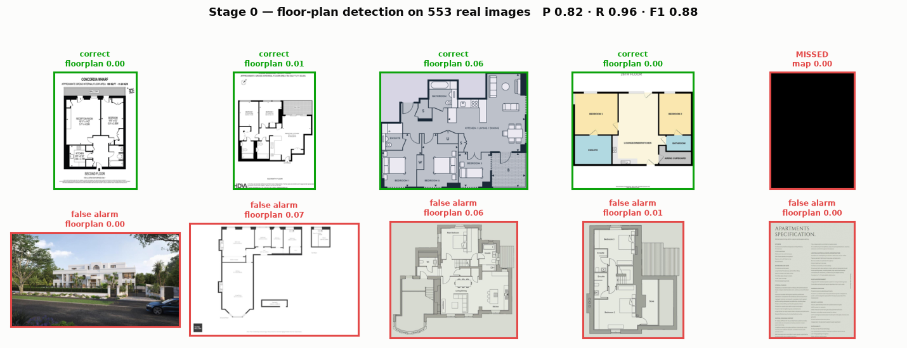
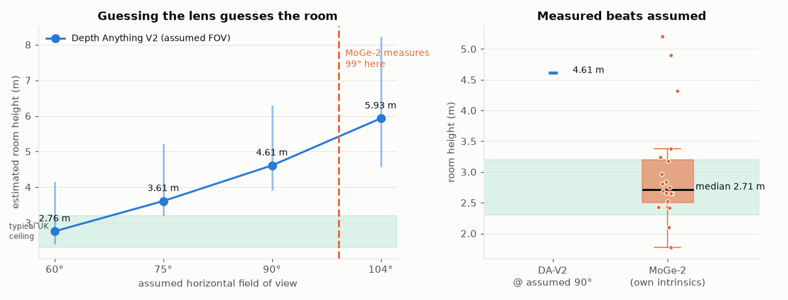
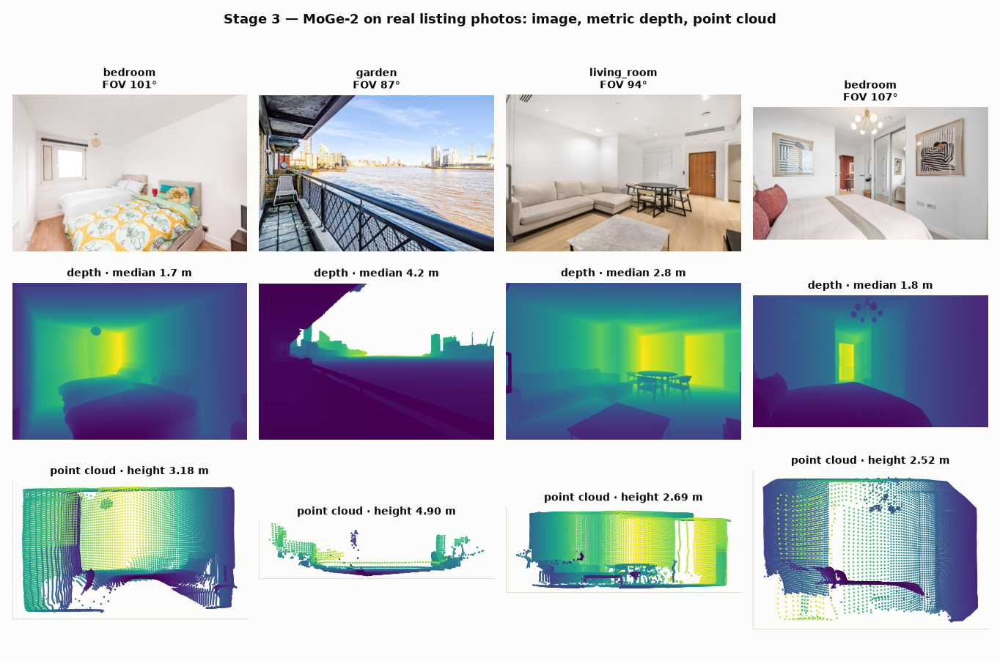
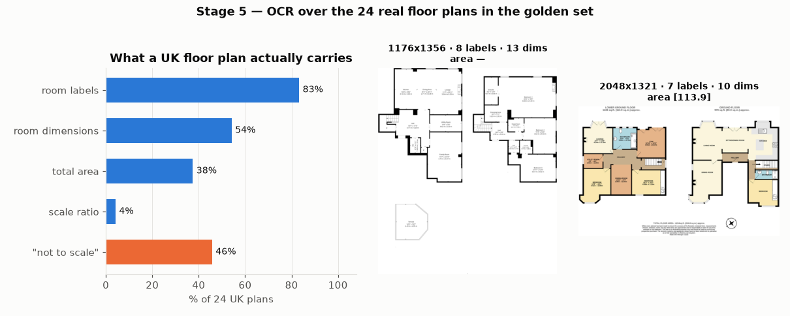

# Model validation report — Phase 0

**Date:** 20 August 2026 · **Hardware:** 4 vCPU, 15 GB RAM, **no GPU** · **Data:** the 30-listing UK golden set (553 real images, 24 portal-labelled floor plans)

Every number here comes from running a real model over real scraped UK listing photographs. Nothing is quoted from a paper. Where a model could not be run, that is stated rather than estimated.

---

## Verdict in one table

| Stage | Model | Ran? | Headline result | Verdict |
|---|---|---|---|---|
| 0 Triage | SigLIP base (203M) | ✅ CPU | **F1 0.96** floor-plan detection, 0 real plans missed | **Works. Ship it.** |
| 0 Room type | SigLIP base | ✅ CPU | Plausible distribution, unlabelled | Needs a labelled set to score |
| 1 Calibration | MoGe-2 intrinsics | ✅ CPU | Median **98.6° FOV** measured on real listings | **Works, and is essential** |
| 3 Geometry (mono) | MoGe-2 (331M) | ✅ CPU | Room height median **2.71 m**, 85% plausible | **Works** |
| 3 Geometry (mono) | Depth Anything V2 Metric Indoor | ✅ CPU | Median **4.61 m** at assumed 90° — wrong | **Rejected as primary** |
| 3 Geometry (multi) | MapAnything | ❌ | Apache weights confirmed downloadable; code is GitHub-only, needs GPU | Untested |
| 4 Layout | Plane fitting (ours) | ✅ CPU | Floor/ceiling recovered on **20/20** images | Works on the easy part |
| 5 Plan OCR | Tesseract 5.3.4 | ✅ CPU | Labels on **83%**, dimensions on **54%** | **Partial — see below** |
| 8 Splatting | gsplat | ❌ | Requires CUDA | Untested, blocked on GPU |

---

## Stage 0 — Triage



Zero-shot SigLIP over all 553 images, scored against the portal's own asset labels, then every disagreement adjudicated by eye at full resolution.

| | Precision | Recall | F1 | Accuracy |
|---|---|---|---|---|
| Against portal labels | 0.821 | 0.958 | 0.885 | 0.989 |
| **After adjudication** | **0.929** | **1.000** | **0.963** | **0.996** |

**The interesting result is why those two numbers differ: the model is more accurate than the portal's metadata.** Of the six disagreements:

- **3 were real floor plans that Rightmove had filed as photos.** The classifier found them; the portal had them mislabelled.
- **1 "floor plan" was an entirely black image** (mean pixel value 3.7/255) — a corrupt asset. The model correctly refused to call it a plan; it counted as a miss only because the portal said otherwise.
- **2 were genuine false positives**: a CGI exterior render, and an "Apartments Specification" text sheet.

After adjudication, **recall is 1.000 — not one real floor plan was missed** in 553 images, at 177 ms/image on CPU.

Two consequences for the roadmap. First, this stage is done: it is cheap, accurate and needs no training data. Second, **portal floor-plan metadata cannot be used as ground truth** — 3 of 27 real plans (11%) were mis-filed, so our true plan coverage is slightly *higher* than the 92.5% measured earlier from the portal's own `numberOfFloorplans` field.

Room-type classification produced a plausible spread over 439 interior photos — bedroom 104, living_room 94, bathroom 66, hallway 47, kitchen 45 — but with no labels there is no honest accuracy figure. Hand-labelling ~200 images is a half-day task and should happen in Sprint 2.

---

## Stages 1, 3, 4 — Calibration and geometry



This is the most important finding of the whole exercise, and it validates decision AD-5 empirically.

**Depth Anything V2 Metric Indoor** produces metric depth but no camera intrinsics, so unprojecting its depth into a point cloud requires *assuming* a field of view. Room height scales almost linearly with that assumption:

| Assumed FOV | Median room height | Plausible (1.8–4.5 m) | Typical (2.3–3.2 m) |
|---|---|---|---|
| 60° | 2.76 m | 88% | 57% |
| 75° | 3.61 m | 75% | 8% |
| 90° | 4.61 m | 40% | 5% |
| 104° | 5.93 m | 10% | 2% |

Only a narrow 60° lens yields plausible ceilings. But **MoGe-2, which predicts intrinsics as part of its forward pass, measures the actual field of view at a median of 98.6°** (p10 86.5°, p90 103.3°) — confirming from real data that estate agents shoot ultra-wide, exactly as the feasibility report claimed. At the *true* field of view, Depth Anything's geometry gives ~6 m ceilings, which is nonsense.

Running MoGe-2 with its own measured intrinsics instead:

| | Median | p10 | p90 | Plausible | Typical |
|---|---|---|---|---|---|
| **MoGe-2 room height** | **2.71 m** | 2.38 m | 4.38 m | **85%** | 65% |

2.71 m is a credible median for UK flats. **The conclusion is unambiguous: a depth model without intrinsics is not usable for metric reconstruction from listing photos, and MoGe-2's intrinsics head is the reason it is the right choice.** Anything that only outputs depth has to be paired with GeoCalib or equivalent.



The layout stage (plane fitting on the point map to find floor and ceiling) recovered a height on 20 of 20 images. The failures are the expected ones — a photo dominated by a single wall has no visible floor-to-ceiling extent to measure.

**Cost:** MoGe-2 runs in **14.4 s/image on 4 CPU cores** at 512px. That is the number to beat with a GPU; it makes the `instant` profile's budget a GPU question, not an algorithm question.

---

## Stage 5 — Floor plan OCR



Tesseract over the 24 real UK plans, at 0.48 s each:

| Signal | Coverage | Why it matters |
|---|---|---|
| Any readable text | 83% | baseline |
| ≥2 room labels | 83% | feeds room↔plan assignment (stage 6) |
| Room dimensions | 54% (62% on ≥1000px plans) | **direct metric scale anchor** |
| Total area | 38% | global scale constraint |
| Scale ratio (1:100) | 4% | rarely printed |
| "Not to scale" disclaimer | 46% | **explicitly disclaims measurement** |

Two findings. **Good:** room labels come through on 83% of plans, which is what stage 6 actually needs to match photos to rooms. **Less good:** dimensions appear on only 54% of plans, and nearly half carry an explicit "not to scale / approximate" disclaimer.

This partially rescues the UK scale problem flagged in `docs/DATA-SOURCES.md` §5. There is no loi Carrez, but printed room dimensions give a direct anchor on roughly **62% of high-resolution plans** — better than the EPC-only fallback assumed. Resolution is the limiting factor, so the scraper should always fetch the largest available plan asset.

---

## What could not be tested

| Model | Blocker | What is needed |
|---|---|---|
| **MapAnything** (AD-4, primary multi-view engine) | Code is GitHub-only (not on PyPI); GitHub is unreachable from repo-scoped sandboxes. Apache weights **are** downloadable from HF (verified, ungated) | Vendor the source as we did for MoGe, and a GPU |
| **gsplat** (stage 8) | Requires CUDA | A GPU box |
| **GeoCalib** (stage 1 cross-check) | Repo + weights via GitHub | Vendoring, or use MoGe-2's intrinsics, which already work |
| Grouping / assembly / scale solve | Not yet implemented — these are our code, not third-party models | Sprints 3–5 |

**The single most valuable next step is a GPU box.** Every remaining unvalidated component is blocked on it, and MoGe-2's 14.4 s/image on CPU is the only thing standing between the current state and an end-to-end Phase 1 run.

---

## Reproducing

```bash
python tools/vendor_moge.py --dest vendor/moge      # MoGe is not on PyPI
python -m eval.models.triage                        # stage 0, ~3 min CPU
python -m eval.models.plan_ocr                      # stage 5, ~15 s
python -m eval.models.geometry --limit 40           # stage 3-4, DA-V2, ~2 min
PYTHONPATH=vendor/moge python -m eval.models.moge_geometry --limit 20   # ~5 min
PYTHONPATH=vendor/moge python -m eval.figures       # figures
```

Raw per-image outputs are in `eval/results/*.json`; the adjudication of every triage disagreement is in `stage0_adjudication.json`.
